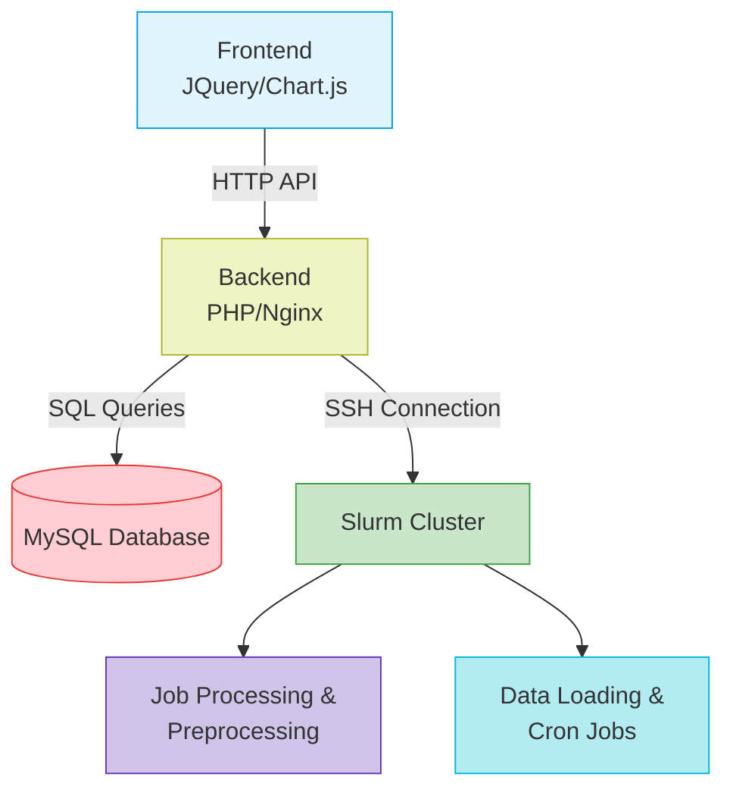

```mermaid

graph TD
    A[Frontend\nJQuery/Chart.js] -->|HTTP API| B[Backend\nPHP/Nginx]
    B -->|SQL Queries| C[(MySQL Database)]
    B -->|SSH Connection| D[Slurm Cluster]
    D --> E[Job Processing &\nPreprocessing]
    D --> F[Data Loading &\nCron Jobs]

    style A fill:#e1f5fe,stroke:#039be5
    style B fill:#f0f4c3,stroke:#afb42b
    style C fill:#ffcdd2,stroke:#e53935
    style D fill:#c8e6c9,stroke:#43a047
    style E fill:#d1c4e9,stroke:#673ab7
    style F fill:#b2ebf2,stroke:#00bcd4

```

